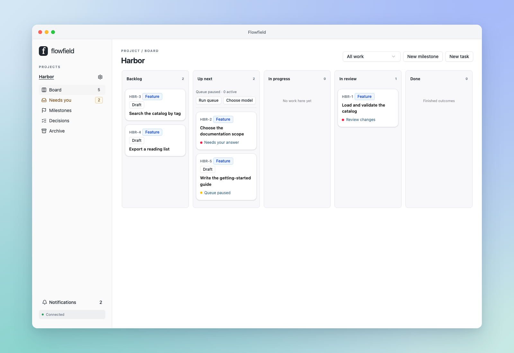

<h1 align="center">Flowfield</h1>

<p align="center"><strong>Plan with your coding agent. Follow every task in one shared feed.</strong></p>

<p align="center">
  <a href="https://pypi.org/project/flowfield-core/"></a>
  <a href="https://github.com/flowfield-sh/flowfield-core/actions/workflows/tests.yml"></a>
  <a href="https://github.com/flowfield-sh/flowfield-core/blob/main/docs/getting-started.mdx"></a>
</p>



Flowfield runs agreed work in parallel and brings progress, questions, answers and results
together for your review. Keep talking to your coordinator while workers implement tasks;
use the board to see what matters and what needs you.

- **Shared task feeds.** Intent, worker activity, questions, testing and results stay together.
- **Parallel work.** Independent tasks run in separate checkouts; dependencies hold work until it's ready.
- **Explicit review.** Inspect or try an exact result, request changes, then approve its delivery to your project.

## Install

```sh
uv tool install --python 3.12 flowfield-core
flowfield serve
```

Open [localhost:8765](http://127.0.0.1:8765). The browser UI is included.
See [Installation](docs/installation.mdx) for the pip alternative.

From an existing project directory:

```sh
flowfield project init
flowfield project guidance preview
flowfield project guidance install
flowfield integration connect codex
```

Start a fresh coding conversation and ask it to read your Flowfield board.
Managed work uses your installed, signed-in Codex CLI and an explicitly selected worker
model. Codex is the first supported harness; further integrations are planned.

## Documentation

[Getting Started](docs/getting-started.mdx) · [Concepts](docs/concepts.mdx) ·
[CLI](docs/cli.mdx) · [Agent integrations](docs/integrations/overview.mdx)

## Build from source

Requires Python 3.12+, uv, Node 24+ and pnpm 11.19.0.

```sh
make setup
pnpm --dir web build
uv run flowfield serve
```

See [CONTRIBUTING.md](CONTRIBUTING.md) for checks and issue reporting.

## License

[Apache License 2.0](LICENSE).
